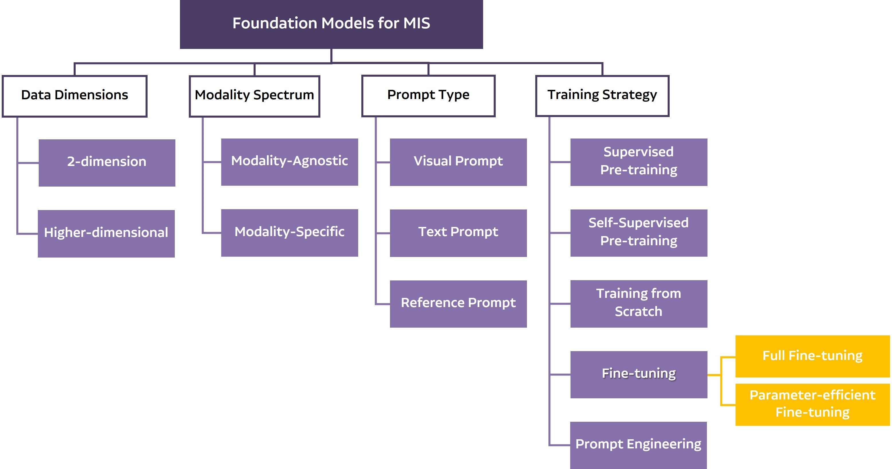

# A Narrative Review of Foundation Models for Medical Image Segmentation: Zero-Shot Performance Evaluation on Diverse Modalities
[](https://github.com/sindresorhus/awesome) [](https://creativecommons.org/licenses/by/4.0/)

This repository was constructed based on paper: [A Narrative Review of Foundation Models for Medical Image Segmentation: Zero-Shot Performance Evaluation on Diverse Modalities]()
## Citation
If you find our work useful in your research, please consider citing:
```bibtex
@article{noh2025foundation,
  title={A Narrative Review of Foundation Models for Medical Image Segmentation: Zero-Shot Performance Evaluation on Diverse Modalities},
  author={Seungha Noh, Byoung-Dai Lee},
  journal={Quantitative Imaging in Medicine and Surgery},
  year={2025},
  note={Accepted, in press}
}
```
🚧 Note: The citation will be updated with volume, page numbers, and DOI after official publication.

## Overview
This repository accompanies our narrative review paper on foundation models for medical image segmentation. Foundation models—large-scale, pre-trained deep learning models capable of adapting to diverse tasks—have shown remarkable contextual understanding and generalization in medical imaging. In our study, we systematically reviewed 63 studies and evaluated the zero-shot performance of six foundation models on 32 unseen medical image datasets from sources like The Cancer Imaging Archive, Kaggle, Zenodo, IEEE DataPort, and Grand Challenge.

<p align="center">
  
</p>

Our review categorizes these models based on data dimension, modality spectrum, prompt type, and training strategy, and provides key insights into their strengths, limitations, and practical applicability in clinical settings. This repository curates all relevant resources including code, datasets, and detailed literature reviews to support further research and development in advancing healthcare AI.

## 📚 Contents

### 🗒️ Survey: Foundation Models in Medical Image Segmentation

<table border="2" cellspacing="0" cellpadding="6"><thead>
  <tr>
    <th class="tg-cly1">Method   </th>
    <th class="tg-cly1">Dimension</th>
    <th class="tg-cly1">Modalities</th>
    <th class="tg-cly1">Year</th>
    <th class="tg-cly1">Code</th>
  </tr></thead>
<tbody>
  <tr>
    <td class="tg-0lax"><a href="https://arxiv.org/pdf/2203.00131">MedFormer</td>
    <td class="tg-0lax">3D</td>
    <td class="tg-0lax">MR</td>
    <td class="tg-0lax">2023.02</td>
    <td class="tg-0lax">   ✅   </td>
  </tr>
  <tr>
    <td class="tg-0lax"><a href="https://link.springer.com/chapter/10.1007/978-3-031-72390-2_60">MedCLIP-SAM</td>
    <td class="tg-0lax">2D</td>
    <td class="tg-0lax">Multi</td>
    <td class="tg-0lax">2023.03</td>
    <td class="tg-0lax">✅</td>
  </tr>
  <tr>
    <td class="tg-0lax"><a href="https://www.sciencedirect.com/science/article/pii/S1361841525000945">Med-SA</td>
    <td class="tg-0lax">2D</td>
    <td class="tg-0lax">Multi</td>
    <td class="tg-0lax">2023.04</td>
    <td class="tg-0lax">✅</td>
  </tr>
  <tr>
    <td class="tg-0lax"><a href="https://www.spiedigitallibrary.org/conference-proceedings-of-spie/12929/129290U/SkinSAM--adapting-the-segmentation-anything-model-for-skin-cancer/10.1117/12.3006837.full">SkinSAM</td>
    <td class="tg-0lax">2D</td>
    <td class="tg-0lax">Dermoscopy</td>
    <td class="tg-0lax">2023.04</td>
    <td class="tg-0lax"> </td>
  </tr>
  <tr>
    <td class="tg-0lax"><a href="https://arxiv.org/pdf/2304.06716">STU-Net</td>
    <td class="tg-0lax">3D</td>
    <td class="tg-0lax">CT</td>
    <td class="tg-0lax">2023.04</td>
    <td class="tg-0lax">✅</td>
  </tr>
  <tr>
    <td class="tg-0lax"><a href="https://openaccess.thecvf.com/content/ICCV2023/papers/Butoi_UniverSeg_Universal_Medical_Image_Segmentation_ICCV_2023_paper.pdf">UniverSeg</td>
    <td class="tg-0lax">2D</td>
    <td class="tg-0lax">Multi</td>
    <td class="tg-0lax">2023.04</td>
    <td class="tg-0lax">✅</td>
  </tr>
  <tr>
    <td class="tg-0lax"><a href="https://arxiv.org/abs/2305.00293">Polyp-SAM</td>
    <td class="tg-0lax">2D</td>
    <td class="tg-0lax">Endoscopy</td>
    <td class="tg-0lax">2023.04</td>
    <td class="tg-0lax">✅</td>
  </tr>
  <tr>
    <td class="tg-0lax"><a href="https://arxiv.org/abs/2304.13785">SAMed</td>
    <td class="tg-0lax">2D</td>
    <td class="tg-0lax">CT</td>
    <td class="tg-0lax">2023.04</td>
    <td class="tg-0lax">✅</td>
  </tr>
  <tr>
    <td class="tg-0lax"><a href="https://www.nature.com/articles/s41467-024-44824-z">MedSAM</td>
    <td class="tg-0lax">2D</td>
    <td class="tg-0lax">Multi</td>
    <td class="tg-0lax">2023.04</td>
    <td class="tg-0lax">✅</td>
  </tr>
  <tr>
    <td class="tg-0lax"><a href="https://arxiv.org/abs/2306.12737">SAM-LST</td>
    <td class="tg-0lax">2D</td>
    <td class="tg-0lax">CT</td>
    <td class="tg-0lax">2023.06</td>
    <td class="tg-0lax">✅</td>
  </tr>
  <tr>
    <td class="tg-0lax"><a href="https://www.sciencedirect.com/science/article/abs/pii/S1361841524002494">3DSAM-Adapter</td>
    <td class="tg-0lax">3D</td>
    <td class="tg-0lax">Multi</td>
    <td class="tg-0lax">2023.06</td>
    <td class="tg-0lax">✅</td>
  </tr>
  <tr>
    <td class="tg-0lax"><a href="https://arxiv.org/abs/2306.16925">MIS-FM</td>
    <td class="tg-0lax">3D</td>
    <td class="tg-0lax">CT</td>
    <td class="tg-0lax">2023.06</td>
    <td class="tg-0lax">✅</td>
  </tr>
  <tr>
    <td class="tg-0lax"><a href="https://arxiv.org/abs/2306.06370">AutoSAM</td>
    <td class="tg-0lax">2D</td>
    <td class="tg-0lax">Multi</td>
    <td class="tg-0lax">2023.06</td>
    <td class="tg-0lax">✅</td>
  </tr>
  <tr>
    <td class="tg-0lax"><a href="https://link.springer.com/chapter/10.1007/978-3-031-47401-9_16">SAM-Path</td>
    <td class="tg-0lax">2D</td>
    <td class="tg-0lax">Pathology</td>
    <td class="tg-0lax">2023.07</td>
    <td class="tg-0lax">✅</td>
  </tr>
  <tr>
    <td class="tg-0lax"><a href="https://arxiv.org/abs/2307.01124">Shi et al.</td>
    <td class="tg-0lax">3D</td>
    <td class="tg-0lax">MR</td>
    <td class="tg-0lax">2023.07</td>
    <td class="tg-0lax"> </td>
  </tr>
  <tr>
    <td class="tg-0lax"><a href="https://www.biorxiv.org/content/10.1101/2023.07.24.550334v1">tUbenet</td>
    <td class="tg-0lax">3D</td>
    <td class="tg-0lax">Multi</td>
    <td class="tg-0lax">2023.07</td>
    <td class="tg-0lax">✅</td>
  </tr>
  <tr>
    <td class="tg-0lax"><a href="https://ojs.aaai.org/index.php/AAAI/article/view/28514">SurgicalSAM</td>
    <td class="tg-0lax">2D</td>
    <td class="tg-0lax">Endoscopy</td>
    <td class="tg-0lax">2023.08</td>
    <td class="tg-0lax">✅</td>
  </tr>
  <tr>
    <td class="tg-0lax"><a href="https://arxiv.org/abs/2308.06623">Polyp-SAM++</td>
    <td class="tg-0lax">2D</td>
    <td class="tg-0lax">Endoscopy</td>
    <td class="tg-0lax">2023.08</td>
    <td class="tg-0lax">✅</td>
  </tr>
  <tr>
    <td class="tg-0lax"><a href="https://dl.acm.org/doi/10.1007/978-3-031-66958-3_14">AdaptiveSAM</td>
    <td class="tg-0lax">2D</td>
    <td class="tg-0lax">Multi</td>
    <td class="tg-0lax">2023.08</td>
    <td class="tg-0lax">✅</td>
  </tr>
  <tr>
    <td class="tg-0lax"><a href="https://arxiv.org/abs/2308.16184">SAM-Med2D</td>
    <td class="tg-0lax">2D</td>
    <td class="tg-0lax">Multi</td>
    <td class="tg-0lax">2023.08</td>
    <td class="tg-0lax">✅</td>
  </tr>
  <tr>
    <td class="tg-0lax"><a href="https://arxiv.org/abs/2306.03908">SAM3D</td>
    <td class="tg-0lax">3D</td>
    <td class="tg-0lax">Multi</td>
    <td class="tg-0lax">2023.09</td>
    <td class="tg-0lax">✅</td>
  </tr>
  <tr>
    <td class="tg-0lax"><a href="https://arxiv.org/abs/2309.11758">SAM-OCTA</td>
    <td class="tg-0lax">2D</td>
    <td class="tg-0lax">OCT</td>
    <td class="tg-0lax">2023.09</td>
    <td class="tg-0lax">✅</td>
  </tr>
  <tr>
    <td class="tg-0lax"><a href="https://openreview.net/pdf/34c7f8042bbfda02a5c80bebae374d3dbf36fa61.pdf">Anand et al.</td>
    <td class="tg-0lax">2D</td>
    <td class="tg-0lax">Multi</td>
    <td class="tg-0lax">2023.09</td>
    <td class="tg-0lax"> </td>
  </tr>
  <tr>
    <td class="tg-0lax"><a href="https://arxiv.org/abs/2309.13539">MediViSTA-SAM</td>
    <td class="tg-0lax">2D</td>
    <td class="tg-0lax">US</td>
    <td class="tg-0lax">2023.09</td>
    <td class="tg-0lax">✅</td>
  </tr>
  <tr>
    <td class="tg-0lax"><a href="https://arxiv.org/abs/2309.08842">MA-SAM</td>
    <td class="tg-0lax">3D</td>
    <td class="tg-0lax">Multi</td>
    <td class="tg-0lax">2023.09</td>
    <td class="tg-0lax">✅</td>
  </tr>
  <tr>
    <td class="tg-0lax"><a href="https://arxiv.org/abs/2310.16872">SonoSAMTrack</td>
    <td class="tg-0lax">2D</td>
    <td class="tg-0lax">US</td>
    <td class="tg-0lax">2023.10</td>
    <td class="tg-0lax"> </td>
  </tr>
  <tr>
    <td class="tg-0lax"><a href="https://openreview.net/pdf?id=ldY0wELcPq">WSI-SAM</td>
    <td class="tg-0lax">2D</td>
    <td class="tg-0lax">Pathology</td>
    <td class="tg-0lax">2023.10</td>
    <td class="tg-0lax">✅</td>
  </tr>
  <tr>
    <td class="tg-0lax"><a href="https://openaccess.thecvf.com/content/ICCV2023W/CVAMD/papers/Pandey_Comprehensive_Multimodal_Segmentation_in_Medical_Imaging_Combining_YOLOv8_with_SAM_ICCVW_2023_paper.pdf">Pandey et al.</td>
    <td class="tg-0lax">2D</td>
    <td class="tg-0lax">Multi</td>
    <td class="tg-0lax">2023.10</td>
    <td class="tg-0lax"> </td>
  </tr>
  <tr>
    <td class="tg-0lax"><a href="https://link.springer.com/chapter/10.1007/978-3-031-47401-9_25">SAMPOT</td>
    <td class="tg-0lax">2D</td>
    <td class="tg-0lax">X-ray</td>
    <td class="tg-0lax">2023.10</td>
    <td class="tg-0lax"> </td>
  </tr>
  <tr>
    <td class="tg-0lax"><a href="https://link.springer.com/chapter/10.1007/978-3-031-44521-7_3">SonoSAM</td>
    <td class="tg-0lax">2D</td>
    <td class="tg-0lax">US</td>
    <td class="tg-0lax">2023.10</td>
    <td class="tg-0lax"> </td>
  </tr>
  <tr>
    <td class="tg-0lax"><a href="https://arxiv.org/abs/2310.15161">SAM-Med3D</td>
    <td class="tg-0lax">3D</td>
    <td class="tg-0lax">Multi</td>
    <td class="tg-0lax">2023.10</td>
    <td class="tg-0lax">✅</td>
  </tr>
  <tr>
    <td class="tg-0lax"><a href="https://ieeexplore.ieee.org/abstract/document/10729707">Eviprompt</td>
    <td class="tg-0lax">2D</td>
    <td class="tg-0lax">Multi</td>
    <td class="tg-0lax">2023.11</td>
    <td class="tg-0lax">✅</td>
  </tr>
  <tr>
    <td class="tg-0lax"><a href="https://www.sciencedirect.com/science/article/abs/pii/S1361841524002950">MedLSAM</td>
    <td class="tg-0lax">3D</td>
    <td class="tg-0lax">CT</td>
    <td class="tg-0lax">2023.11</td>
    <td class="tg-0lax">✅</td>
  </tr>
  <tr>
    <td class="tg-0lax"><a href="https://www.biorxiv.org/content/10.1101/2023.11.17.567630v4">CellSAM</td>
    <td class="tg-0lax">2D</td>
    <td class="tg-0lax">Multi</td>
    <td class="tg-0lax">2023.11</td>
    <td class="tg-0lax">✅</td>
  </tr>
  <tr>
    <td class="tg-0lax"><a href="https://neurips.cc/virtual/2024/poster/96893">SegVol</td>
    <td class="tg-0lax">3D</td>
    <td class="tg-0lax">CT</td>
    <td class="tg-0lax">2023.11</td>
    <td class="tg-0lax">✅</td>
  </tr>
  <tr>
    <td class="tg-0lax"><a href="https://arxiv.org/abs/2311.12539">GMISeg</td>
    <td class="tg-0lax">2D</td>
    <td class="tg-0lax">Multi</td>
    <td class="tg-0lax">2023.12</td>
    <td class="tg-0lax"> </td>
  </tr>
  <tr>
    <td class="tg-0lax"><a href="https://arxiv.org/abs/2312.00312">SAM-CLNet</td>
    <td class="tg-0lax">2D</td>
    <td class="tg-0lax">Endoscopy</td>
    <td class="tg-0lax">2023.12</td>
    <td class="tg-0lax"> </td>
  </tr>
  <tr>
    <td class="tg-0lax"><a href="https://arxiv.org/abs/2312.14481">SP-SAM</td>
    <td class="tg-0lax">2D</td>
    <td class="tg-0lax">Endoscopy</td>
    <td class="tg-0lax">2023.12</td>
    <td class="tg-0lax">✅</td>
  </tr>
  <tr>
    <td class="tg-0lax"><a href="https://arxiv.org/abs/2312.17183">SAT</td>
    <td class="tg-0lax">3D</td>
    <td class="tg-0lax">Multi</td>
    <td class="tg-0lax">2023.12</td>
    <td class="tg-0lax">✅</td>
  </tr>
  <tr>
    <td class="tg-0lax"><a href="https://openaccess.thecvf.com/content/WACV2024/papers/Yan_AFTer-SAM_Adapting_SAM_With_Axial_Fusion_Transformer_for_Medical_Imaging_WACV_2024_paper.pdf">AFTer-SAM</td>
    <td class="tg-0lax">3D</td>
    <td class="tg-0lax">CT</td>
    <td class="tg-0lax">2024.01</td>
    <td class="tg-0lax"> </td>
  </tr>
  <tr>
    <td class="tg-0lax"><a href="https://arxiv.org/abs/2211.09233">PUNETR</td>
    <td class="tg-0lax">2D</td>
    <td class="tg-0lax">CT</td>
    <td class="tg-0lax">2024.01</td>
    <td class="tg-0lax">✅</td>
  </tr>
  <tr>
    <td class="tg-0lax"><a href="https://www.sciencedirect.com/science/article/abs/pii/S1361841525000179">SegmentAnyBone</td>
    <td class="tg-0lax">3D</td>
    <td class="tg-0lax">MR</td>
    <td class="tg-0lax">2024.01</td>
    <td class="tg-0lax">✅</td>
  </tr>
  <tr>
    <td class="tg-0lax"><a href="https://arxiv.org/abs/2402.16663">UN-SAM</td>
    <td class="tg-0lax">2D</td>
    <td class="tg-0lax">Microscopy</td>
    <td class="tg-0lax">2024.02</td>
    <td class="tg-0lax">✅</td>
  </tr>
  <tr>
    <td class="tg-0lax"><a href="https://arxiv.org/abs/2403.05114">APPLE</td>
    <td class="tg-0lax">2D</td>
    <td class="tg-0lax">Multi</td>
    <td class="tg-0lax">2024.03</td>
    <td class="tg-0lax"> </td>
  </tr>
  <tr>
    <td class="tg-0lax"><a href="https://arxiv.org/abs/2403.08059">FluoroSAM</td>
    <td class="tg-0lax">2D</td>
    <td class="tg-0lax">X-ray</td>
    <td class="tg-0lax">2024.03</td>
    <td class="tg-0lax">✅</td>
  </tr>
  <tr>
    <td class="tg-0lax"><a href="https://arxiv.org/abs/2310.19721">ProMISe</td>
    <td class="tg-0lax">2D</td>
    <td class="tg-0lax">Multi</td>
    <td class="tg-0lax">2024.03</td>
    <td class="tg-0lax">✅</td>
  </tr>
  <tr>
    <td class="tg-0lax"><a href="https://pubmed.ncbi.nlm.nih.gov/38827779/">SAIM</td>
    <td class="tg-0lax">2D</td>
    <td class="tg-0lax">US</td>
    <td class="tg-0lax">2024.03</td>
    <td class="tg-0lax"> </td>
  </tr>
  <tr>
    <td class="tg-0lax"><a href="https://ieeexplore.ieee.org/document/10581523">Zhou et al.</td>
    <td class="tg-0lax">2D</td>
    <td class="tg-0lax">MR</td>
    <td class="tg-0lax">2024.03</td>
    <td class="tg-0lax"> </td>
  </tr>
  <tr>
    <td class="tg-0lax"><a href="https://arxiv.org/abs/2305.10300">One-Prompt Segmentation</td>
    <td class="tg-0lax">2D</td>
    <td class="tg-0lax">Multi</td>
    <td class="tg-0lax">2024.04</td>
    <td class="tg-0lax">✅</td>
  </tr>
  <tr>
    <td class="tg-0lax"><a href="https://arxiv.org/abs/2404.16325">Hedda</td>
    <td class="tg-0lax">2D</td>
    <td class="tg-0lax">US</td>
    <td class="tg-0lax">2024.04</td>
    <td class="tg-0lax"> </td>
  </tr>
  <tr>
    <td class="tg-0lax"><a href="https://ieeexplore.ieee.org/document/10267971">MAFUnet</td>
    <td class="tg-0lax">3D</td>
    <td class="tg-0lax">MR</td>
    <td class="tg-0lax">2024.05</td>
    <td class="tg-0lax">✅</td>
  </tr>
  <tr>
    <td class="tg-0lax"><a href="https://openaccess.thecvf.com/content/CVPR2024W/DCAMI/papers/Soberanis-Mukul_GSAMCutie_Text-Promptable_Tool_Mask_Annotation_for_Endoscopic_Video_CVPRW_2024_paper.pdf">GSAM+Cutie</td>
    <td class="tg-0lax">2D</td>
    <td class="tg-0lax">Endoscopy</td>
    <td class="tg-0lax">2024.06</td>
    <td class="tg-0lax">✅</td>
  </tr>
  <tr>
    <td class="tg-0lax"><a href="https://openaccess.thecvf.com/content/CVPR2024/papers/Gao_Training_Like_a_Medical_Resident_Context-Prior_Learning_Toward_Universal_Medical_CVPR_2024_paper.pdf">Hermes</td>
    <td class="tg-0lax">2D</td>
    <td class="tg-0lax">Multi</td>
    <td class="tg-0lax">2024.06</td>
    <td class="tg-0lax">✅</td>
  </tr>
  <tr>
    <td class="tg-0lax"><a href="https://www.mdpi.com/2076-3417/14/12/5007">WSPolyp-SAM</td>
    <td class="tg-0lax">2D</td>
    <td class="tg-0lax">Endoscopy</td>
    <td class="tg-0lax">2024.06</td>
    <td class="tg-0lax"> </td>
  </tr>
  <tr>
    <td class="tg-0lax"><a href="https://arxiv.org/pdf/2405.10246">MoME</td>
    <td class="tg-0lax">3D</td>
    <td class="tg-0lax">MR</td>
    <td class="tg-0lax">2024.07</td>
    <td class="tg-0lax">✅</td>
  </tr>
  <tr>
    <td class="tg-0lax"><a href="https://arxiv.org/pdf/2407.14153v4">ESP-MedSAM</td>
    <td class="tg-cly1">2D</td>
    <td class="tg-0lax">Multi</td>
    <td class="tg-0lax">2024.07</td>
    <td class="tg-0lax">✅</td>
  </tr>
  <tr>
    <td class="tg-0lax"><a href="https://openaccess.thecvf.com/content/CVPR2024W/DEF-AI-MIA/papers/Zohranyan_Dr-SAM_An_End-to-End_Framework_for_Vascular_Segmentation_Diameter_Estimation_and_CVPRW_2024_paper.pdf">DrSAM</td>
    <td class="tg-cly1">2D</td>
    <td class="tg-0lax">Multi</td>
    <td class="tg-0lax">2024.07</td>
    <td class="tg-0lax">✅</td>
  </tr>
  <tr>
    <td class="tg-0lax"><a href="https://openaccess.thecvf.com/content/CVPR2023/html/Zhou_Class-Conditional_Sharpness-Aware_Minimization_for_Deep_Long-Tailed_Recognition_CVPR_2023_paper.html">CC-SAM</td>
    <td class="tg-cly1">2D</td>
    <td class="tg-0lax">US</td>
    <td class="tg-0lax">2024.07</td>
    <td class="tg-0lax"> </td>
  </tr>
  <tr>
    <td class="tg-0lax"><a href="https://arxiv.org/pdf/2309.06824">SAMUS</td>
    <td class="tg-cly1">2D</td>
    <td class="tg-0lax">US</td>
    <td class="tg-0lax">2024.07</td>
    <td class="tg-0lax">✅</td>
  </tr>
  <tr>
    <td class="tg-0lax"><a href="https://link.springer.com/chapter/10.1007/978-3-031-72390-2_48">DeSAM</td>
    <td class="tg-cly1">2D</td>
    <td class="tg-0lax">Multi</td>
    <td class="tg-0lax">2024.07</td>
    <td class="tg-0lax">✅</td>
  </tr>
  <tr>
    <td class="tg-0lax"><a href="https://arxiv.org/html/2408.09886v1">SAM-UNet</td>
    <td class="tg-cly1">2D</td>
    <td class="tg-0lax">Multi</td>
    <td class="tg-0lax">2024.08</td>
    <td class="tg-0lax">✅</td>
  </tr>
  <tr>
    <td class="tg-0lax"><a href="https://arxiv.org/pdf/2406.10395">BrainSegFounder</td>
    <td class="tg-cly1">3D</td>
    <td class="tg-0lax">MR</td>
    <td class="tg-0lax">2024.08</td>
    <td class="tg-0lax">✅</td>
  </tr>
  <tr>
    <td class="tg-0lax"><a href="https://arxiv.org/pdf/2406.00663v1">SimSAM</td>
    <td class="tg-cly1">2D,3D</td>
    <td class="tg-0lax">Multi</td>
    <td class="tg-0lax">2024.08</td>
    <td class="tg-0lax">✅</td>
  </tr>
</tbody></table>


### 🔍 Zero-Shot Inference Experiments

### Target Models

<table border="2" cellspacing="0" cellpadding="6">
  <thead>
    <tr>
      <th>Dimension</th>
      <th>Model</th>
      <th>Image Domain</th>
      <th>Dataset Scale</th>
      <th>Baseline</th>
      <th>Prompt Type</th>
      <th>Inference Input</th>
    </tr>
  </thead>
  <tbody>
    <tr>
      <td rowspan="4">2D</td>
      <td>SAM-256</td>
      <td>Natural</td>
      <td>1.1B Masks †</td>
      <td>SAM</td>
      <td>Bbox, Point</td>
      <td>256 × 256</td>
    </tr>
    <tr>
      <td>SAM-1024</td>
      <td>Natural</td>
      <td>1.1B Masks †</td>
      <td>SAM</td>
      <td>Bbox, Point</td>
      <td>1024 × 1024</td>
    </tr>
    <tr>
      <td>MedSAM</td>
      <td>Medical</td>
      <td>1.1M Masks</td>
      <td>SAM</td>
      <td>Bbox, Point</td>
      <td>1024 × 1024</td>
    </tr>
    <tr>
      <td>SAM-Med2D</td>
      <td>Medical</td>
      <td>19.7M Masks</td>
      <td>SAM</td>
      <td>Bbox, Point</td>
      <td>256 × 256</td>
    </tr>
    <tr>
      <td rowspan="4">3D</td>
      <td>UniverSeg</td>
      <td>Medical</td>
      <td>22K Scans</td>
      <td>UNet</td>
      <td>Reference</td>
      <td>128 × 128</td>
    </tr>
    <tr>
      <td>SAM-Med3D</td>
      <td>Medical</td>
      <td>131K Masks</td>
      <td>SAM</td>
      <td>Point</td>
      <td>128 × 128 × 128</td>
    </tr>
    <tr>
      <td>SegVol</td>
      <td>Medical</td>
      <td>150K Masks</td>
      <td>SAM</td>
      <td>Bbox, Point, Text</td>
      <td>*</td>
    </tr>
    <tr>
      <td>SAT-pro</td>
      <td>Medical</td>
      <td>302K Masks</td>
      <td>SAM</td>
      <td>Text</td>
      <td>512 × 512 × 512</td>
    </tr>
  </tbody>
</table>
<p class="footnote">
<sup>†</sup> Datasets are from the natural domain, not medical datasets. <sup>*</sup> SegVol supports all inference input types.
</p>


### Evaluation Datasets

32 unseen medical image datasets from TICA, Kaggle, Zendo, IEEE DataPort, Grand Challenge. 
detailed dataset info to a subpage: [Datasets to evaluate zero-shot performance](./documentation/dataset.md)

### Overall Results
Performance evaluation of foundation models on 2D and 3D datasets. DSC scores evaluated across four groups: RGB, grayscale (2D/3D), CT, and MR.

<table border="2" cellspacing="0" cellpadding="6">
  <thead>
    <tr>
      <th rowspan="2">Model</th>
      <th colspan="2">2D</th>
      <th colspan="3">3D</th>
    </tr>
    <tr>
      <th>RGB</th>
      <th>Grayscale</th>
      <th>Grayscale</th>
      <th>CT</th>
      <th>MR</th>
    </tr>
  </thead>
  <tbody>
    <tr>
      <td>SAM-256</td>
      <td>0.249</td>
      <td>0.334</td>
      <td>0.229</td>
      <td>0.186</td>
      <td>0.219</td>
    </tr>
    <tr>
      <td>SAM-1024</td>
      <td><strong>0.485</strong></td>
      <td>0.492</td>
      <td>0.238</td>
      <td>0.406</td>
      <td>0.213</td>
    </tr>
    <tr>
      <td>MedSAM</td>
      <td>0.328</td>
      <td><strong>0.637</strong></td>
      <td>0.307</td>
      <td>0.211</td>
      <td>0.340</td>
    </tr>
    <tr>
      <td>SAM-Med2D</td>
      <td>0.411</td>
      <td>0.447</td>
      <td><strong>0.399</strong></td>
      <td><strong>0.491</strong></td>
      <td><strong>0.562</strong></td>
    </tr>
    <tr>
      <td>UniverSeg</td>
      <td>0.145</td>
      <td>0.511</td>
      <td>0.063</td>
      <td>0.233</td>
      <td>0.213</td>
    </tr>
    <tr>
      <td>SAM-Med3D</td>
      <td>–</td>
      <td>–</td>
      <td>0.310</td>
      <td>0.285</td>
      <td>0.264</td>
    </tr>
    <tr>
      <td>SegVol</td>
      <td>–</td>
      <td>–</td>
      <td>0.182</td>
      <td>0.250</td>
      <td>0.220</td>
    </tr>
    <tr>
      <td>SAT-pro</td>
      <td>–</td>
      <td>–</td>
      <td>0.054</td>
      <td>0.125</td>
      <td>0.213</td>
    </tr>
  </tbody>
</table>

## License
This repository is licensed under the [Creative Commons Attribution 4.0 International (CC BY 4.0)](https://creativecommons.org/licenses/by/4.0/).  
You are free to share and adapt the materials with proper attribution.  
**Note**: All external datasets and referenced papers retain their original licenses.